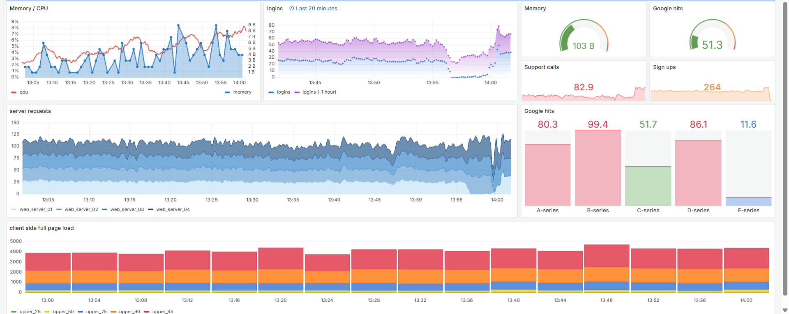

# RBC Production Support Simulator

This project simulates a real-world production support environment for enterprise applications, aligned with the RBC Application Support Analyst role.

## 🔧 Features
- Bash scripts for health checks and backup jobs
- SQL query to analyze error logs
- CI/CD automation using GitHub Actions
- Incident and resolution tracking in ITIL format
- Mock dashboard screenshot (to be added)

## 📁 Structure
- `scripts/` — Bash scripts for diagnostics and automation
- `sql/` — Sample SQL queries for log analysis
- `.github/workflows/` — CI/CD pipeline with cron-style job scheduling
- `jira_ticket_example.md` — Sample incident ticket
- `incident_summary.md` — Post-incident root cause documentation

## 🔍 Relevance to RBC
This simulates:
- Production incident response
- Monitoring and backup automation
- Batch job scheduling
- ITIL-style ticketing and root cause analysis

## 📊 Tools Used
- Bash, GitHub Actions, SQL, Prometheus/Grafana (simulated), Markdown

## 🖥️ Dashboard Example

This dashboard simulates real-time monitoring of system health, including CPU usage, memory, and I/O.

